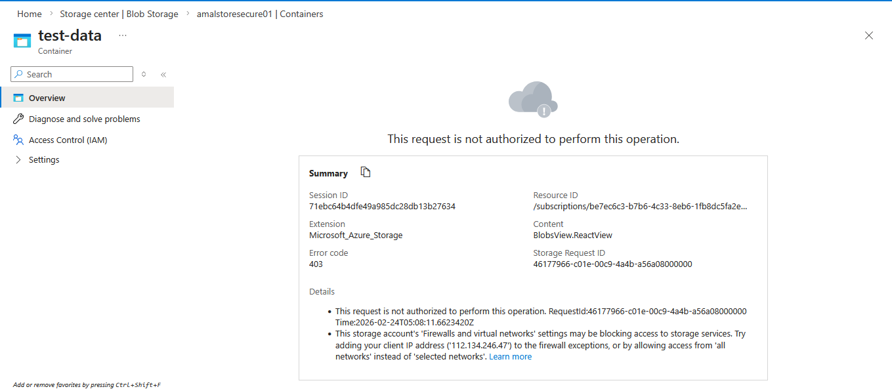
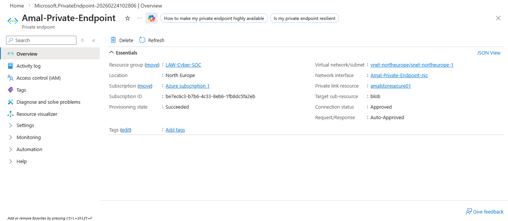

# 🔐 Azure Storage Security with Private Endpoint (Zero Trust Implementation)

## 📖 Overview

This project demonstrates how to secure an Azure Storage Account using:

- Public Network Access Disabled
- Azure Private Endpoint
- Private DNS Zone Integration
- Network Isolation (Zero Trust Model)
- Access Validation (403 Unauthorized Testing)

This setup reflects enterprise-grade Azure security architecture.

---

## 🏗️ Architecture Overview

### 🔎 Architecture Highlights

- Public Internet access blocked
- Storage Account isolated from public network
- Private Endpoint deployed inside VNet
- Private DNS Zone resolving to private IP
- Secure internal connectivity via Azure backbone

---

## 🚫 Step 1 – Disable Public Access

Public network access was disabled to eliminate internet exposure.

---

## ❌ Step 2 – Unauthorized Access Validation

Attempted access from outside VNet resulted in:

- HTTP 403 Error
- Firewall blocking message
- Access denied confirmation

This confirms the storage account is not publicly reachable.

---

## 🔒 Step 3 – Private Endpoint Deployment

Private Endpoint configured with:

- Target: Blob
- VNet: vnet-northeurope
- Subnet: PrivateEndpoint-Subnet
- Connection Status: Approved

---

## 🧠 Security Validation Checklist

✔ Public Network Access Disabled  
✔ Private Endpoint Approved  
✔ External Access Blocked (403)  
✔ Zero Trust Design Applied  

---

## 🎯 Key Security Concepts Demonstrated

- Azure PaaS Hardening
- Data Exfiltration Prevention
- Private Connectivity Architecture
- Secure Cloud Network Design

---

## 🚀 Future Enhancements

- Enable Microsoft Defender for Storage
- Implement RBAC-only access model
- Add NSG restrictions
- Enable Diagnostic Logging

---

## 👨‍💻 Author

Amal Ubasnayake  
Cloud & Cybersecurity Enthusiast  
Sri Lanka
