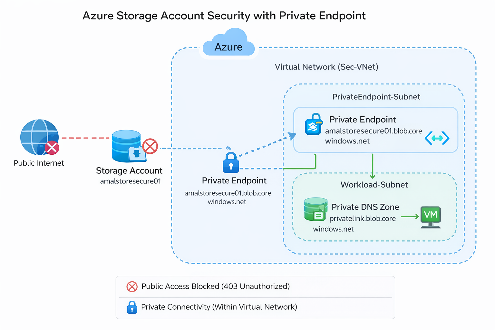

# 🔐 Azure Storage Security with Private Endpoint  
### 🚀 Zero Trust Implementation in Azure

---

## 📖 Overview

This project demonstrates how to secure an **Azure Storage Account** using enterprise-grade security controls:

- 🚫 Public Network Access Disabled  
- 🔒 Azure Private Endpoint Implemented  
- 🌐 Private DNS Zone Integration  
- 🛡 Network Isolation (Zero Trust Model)  
- ✅ Access Validation (403 Unauthorized Testing)  

This lab reflects **real-world cloud security architecture practices**.

---

## 🏗️ Architecture Overview

  

### 🔎 Architecture Highlights

- Public Internet access completely blocked  
- Storage Account isolated from public exposure  
- Private Endpoint deployed inside secure VNet  
- Private DNS resolving to private IP address  
- Secure connectivity via Azure backbone network  

---

## 🚫 Step 1 – Disable Public Access

Public network access was disabled to eliminate internet exposure.

  

---

## ❌ Step 2 – Unauthorized Access Validation

Access attempt from outside the Virtual Network resulted in:

- ❌ HTTP 403 Error  
- 🔥 Firewall blocking message  
- 🚫 Access denied confirmation  

  

✔ This confirms the storage account is not publicly reachable.

---

## 🔒 Step 3 – Private Endpoint Deployment

Private Endpoint configured with:

- **Target:** Blob  
- **VNet:** vnet-northeurope  
- **Subnet:** PrivateEndpoint-Subnet  
- **Connection Status:** Approved  

  

---

## 🧠 Security Validation Checklist

| Control | Status |
|---------|--------|
| Public Network Access Disabled | ✅ |
| Private Endpoint Approved | ✅ |
| External Access Blocked (403) | ✅ |
| Zero Trust Design Applied | ✅ |

---

## 🎯 Key Security Concepts Demonstrated

- Azure PaaS Hardening  
- Data Exfiltration Prevention  
- Private Connectivity Architecture  
- Secure Cloud Network Design  
- Zero Trust Implementation  

---

## 🚀 Future Enhancements

- Enable Microsoft Defender for Storage  
- Implement RBAC-only access model  
- Add NSG restrictions  
- Enable Diagnostic Logging  
- Integrate with Microsoft Sentinel  

---

## 👨‍💻 Author

**Amal Udayanga Basnayake**  
Cloud & Cybersecurity Enthusiast 🇱🇰  
IT Operations | Azure Security | Zero Trust Architecture  

---

> 🔐 *Cloud security is not about adding tools. It’s about reducing exposure.*
